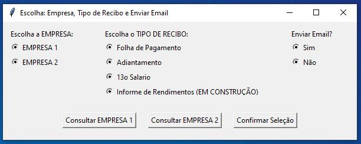
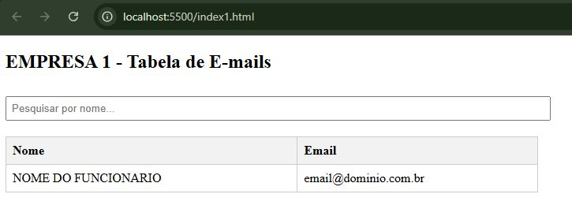
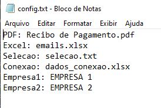
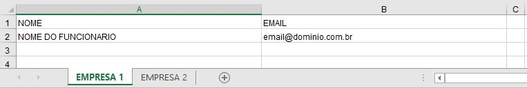

### Recibo de Pagamento em PDF
- dividir arquivo em PDF e salvar para cada funcionário
- enviar email para o funcionário com o recibo em anexo

#### Bibliotecas
- python.exe -m pip install --upgrade pip
- pip install PyPDF2, pandas, imbox
- subprocess
- webbrowser
- os
- re
- smtplib
- email.message
- imbox
- pandas
- PyPDF2
- tkinter

#### Criar um .bat simples
- executar_app.bat

#### Tela Inicial

#### Consulta os emails dos funcionários de cada empresa

#### Arquivo para alterar os nomes das empresas: config.txt

#### Arquivo para alterar os dados_conexao.xlsx

#### Arquivo para alterar os emails.xlsx

